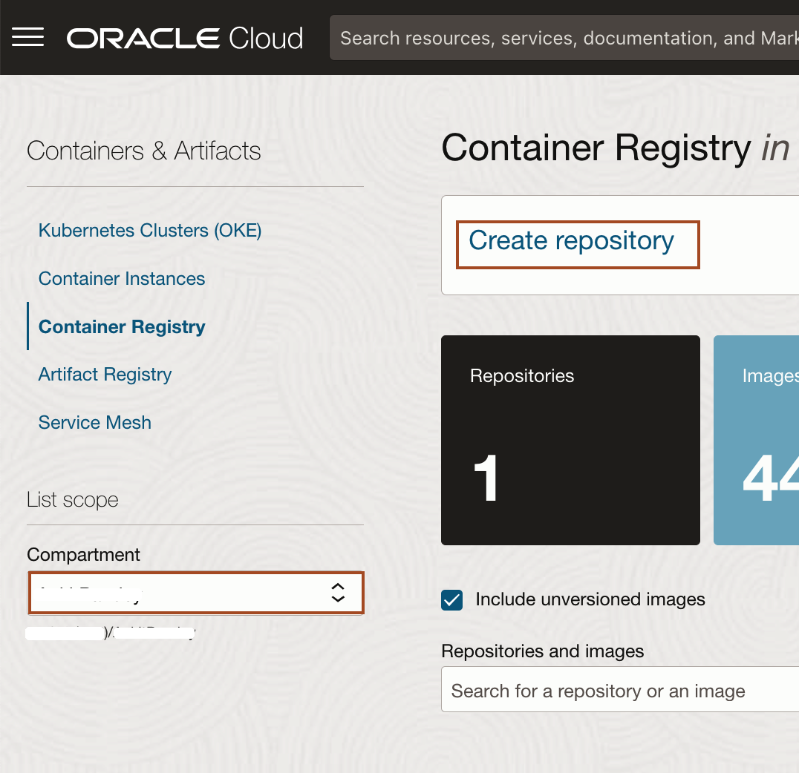
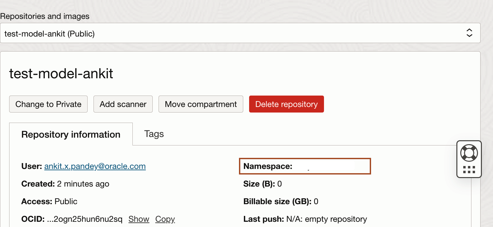
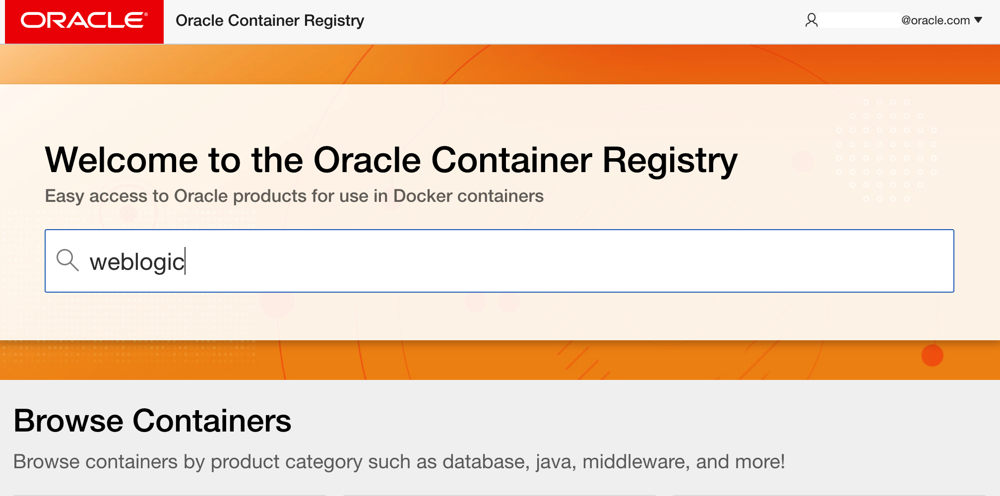

# Setup the Lab Environment

## Introduction

In this lab, you will create a 3-node Kubernetes cluster configured with all of the necessary network resources. Also, you will create a repository inside Oracle Cloud Container Image Registry. Then, you will generate an authentication token. Further, you will accept the license agreement for WebLogic Server images in Oracle Container Registry.

Estimated Time: 15 minutes

Watch the video below for a quick walk-through of the lab.
[Setup the Lab Environment](videohub:1_zhvohpqq)

### Objectives

In this lab, you will:

* Create a repository inside Oracle Cloud Container Image Registry.
* Accept the license for WebLogic Server Images in Oracle Container Registry.

### Prerequisites

* You must have an [Oracle Cloud Infrastructure](https://cloud.oracle.com/en_US/cloud-infrastructure) enabled account.
* You must have an Oracle Account. 
* You should have a text editor.

## Task 1: Creation of an Repository

In this task, you creates a public repository. In lab 5, we will push Auxiliary Image into this repository.

1. In Remote Desktop, To open Firefox, click **Activities**, Type **Fire** in search box and then click **Firefox** as shown.
    

2. Login to the [Oracle Cloud Console](https://cloud.oracle.com) using your credentials.

3. In the Console, select the *Hamburger Menu* -> *Developer Services* -> *Container Registry* as shown.
    

4. Select your compartment, where you are allowed to create the repository. Click *Create repository*.
    

5. Enter *`test-model-your_firstname`* as Repository name and Access as *Public* then click *Create*.
    

6. Once your repository is ready. Please note down the tenancy namespace in your text file.
    

## Task 2: Accepting the license for WebLogic Server Images 

In this task, we accept the license agreement for WebLogic Server images resides in Oracle Container Registry. As in Lab 5, we will use WebLogic Server 12.2.1.3.0 image as our Primary Image. So, to get access to WebLogic Server Images, we accept the license agreement.

1. Click the link for the Oracle Container Registry [https://container-registry.oracle.com/](https://container-registry.oracle.com/) and sign in. For this, you need an Oracle Account.
    
    
2. Enter your *Oracle Account Credentials* in the Username and Password fields, and then click *Sign In*.
    

3. In the Home page of Oracle Container Registry, Search for *weblogic*.
    

4. Click *weblogic* as shown and select *English* as the language, then click *Continue*.
    
    

5. Click *Accept* to accept the license agreement.
    

## Learn More

*About Oracle Cloud Infrastructure Container Engine for Kubernetes*

Oracle Cloud Infrastructure Container Engine for Kubernetes is a fully-managed, scalable, and highly available service that you can use to deploy your container applications to the cloud. Use the Container Engine for Kubernetes (sometimes abbreviated OKE) when your development team wants to reliably build, deploy, and manage cloud-native applications. You specify the compute resources that your applications require, and OKE provisions them on the Oracle Cloud Infrastructure in an existing OCI tenancy.

## Acknowledgements

* **Author** -  Ankit Pandey
* **Contributors** - Maciej Gruszka, Sid Joshi
* **Last Updated By/Date** - Ankit Pandey, October 2023
